# 2024 Q4

Greetings! Whenever one does a dev diary it's important to make the first sentence the reader reads be something meaningful - after they've finished looking at the titles and images that follow. Then they will probably read this text after to know what the fuck each image means.

This quarter has been incredibly productive, making strides towards fixing bugs, crashes, compatibility issues, instability with multiplayer, and other much needed goodies.

Let's start off with... the gameplay itself shall we?

## Portability, and ease-of-use

Yes, KE is portable, no need to put it in your Vic2 installation folder :>

## General summary

- Economy more like the original
- Vanilla fonts for the map
- Bunch of new modding extensions
- Lots of fixes and tweaking to the AI (it's less dumb now)
- Implemented experience for units
- Fixed combat
- Lots of bugfixes and crash fixes
- Lots and lots of bugfixes w.r.t to mod compatibility
- Dynamic buildings
- Fix rebels spawning every 0.5 nanoseconds
- Crashes with GFM fixed and such
- Fixes to stuff that caused OOS

## What the fuck have you been doing?

Let's start with the most lovely thing ever: the economy.

To not write a novel, I'll keep it short: the AI builds and minmaxes factories (accounting for bonuses from like "steel factory gets bonus for having iron on state" and so on). They subsidize and quickly build up industry and scale. For example the Russian AI will scale quickly after 1860's.

Sphere dup bug is replicated so you can make use of your spheres better. At this point it's not a bug, it's a feature!

**Average Germany in KE, 1876**: This Germany was built by the AI while I was spectating (you can give AI control of your nation and watch it do things with `toggle_ai TAG`)

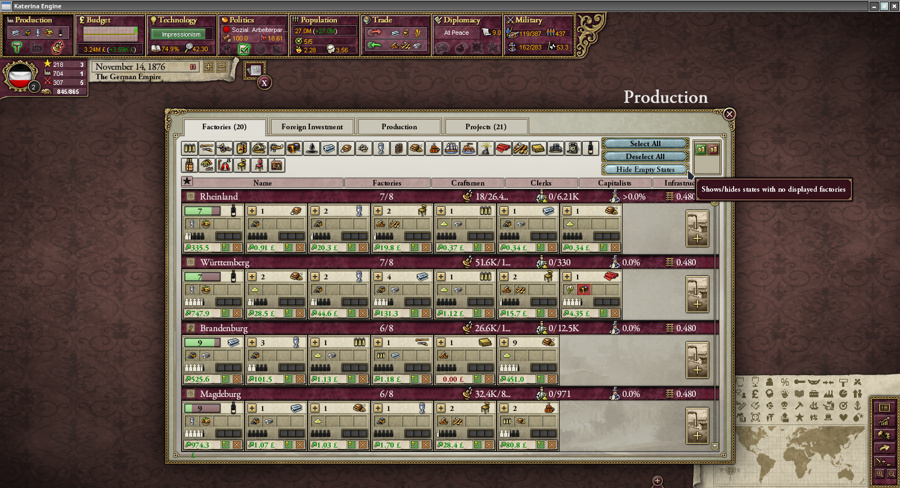

**Vanilla font for the map**: Y'all seem to love it, so might as well implement it :)

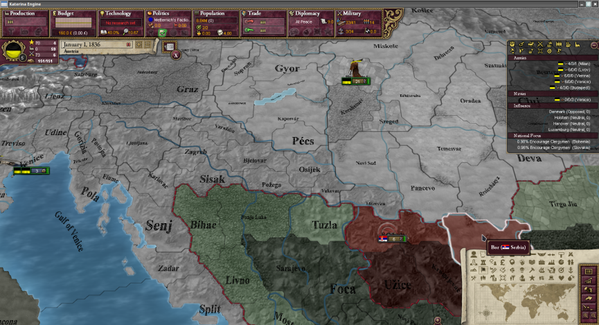

**Working .DDS texturesheets**: Mods such as IGOR and AoE Multiplayer-Remake-Optimizado will now properly work with their corresponding texturesheets.

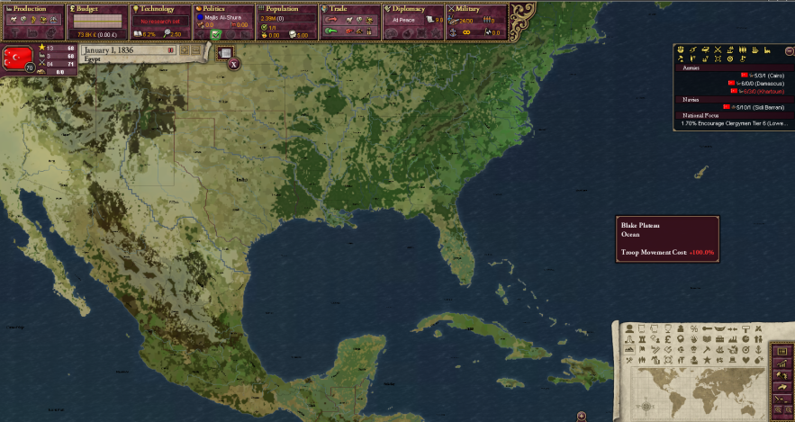

**Smoother borders**: Love some smoother borders :D (before and after)

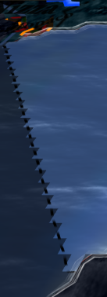
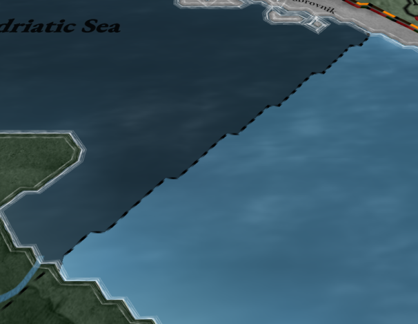

## Screenshots in-game

**Dead UK**

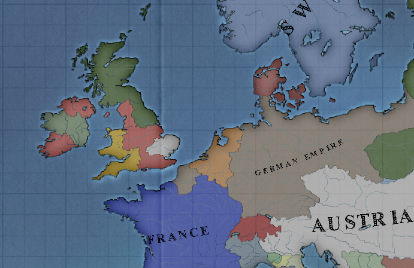

**Based Scandinavian AI**

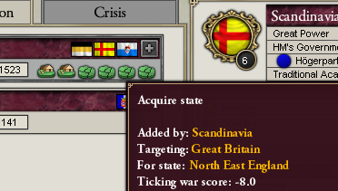

**"I AM NAPOLEOOOOON"**

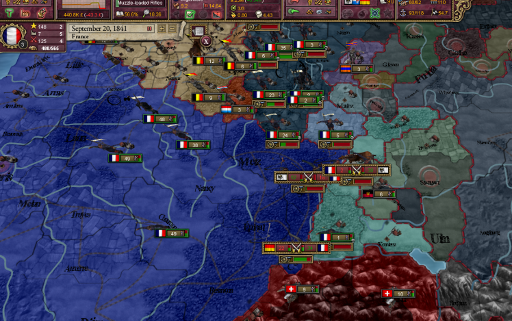

**Le epic encirclement**

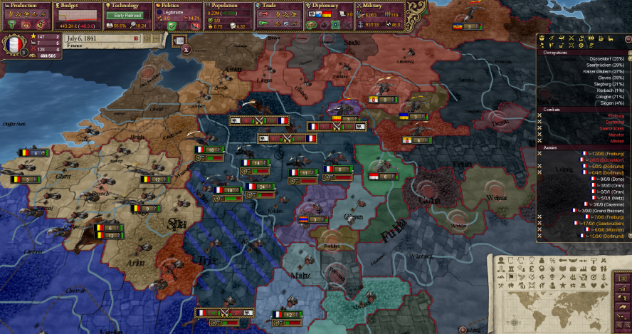

**Early mod compatibility testing**: This mod had so many bugs that it helped me decipher the "broken" behaviour that I needed to replicate

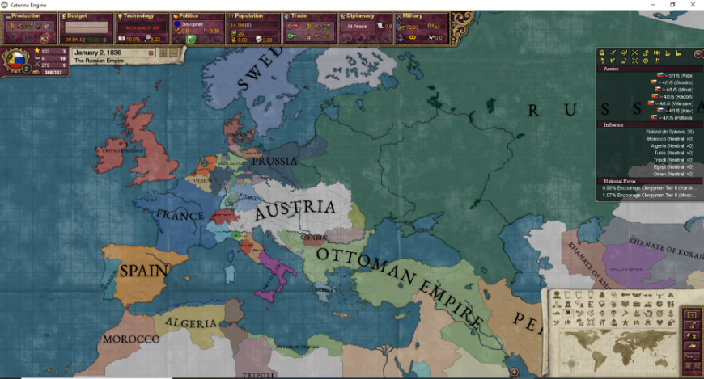

**Early multiplayer testing**

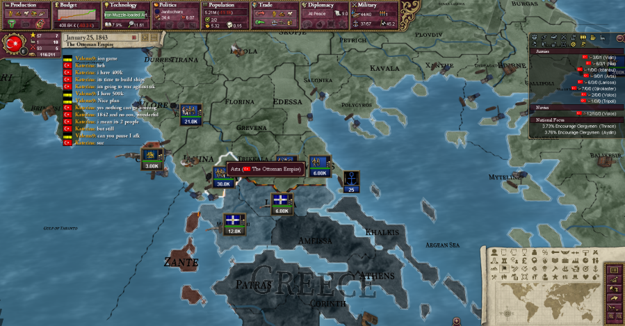

**Early 3D map development**

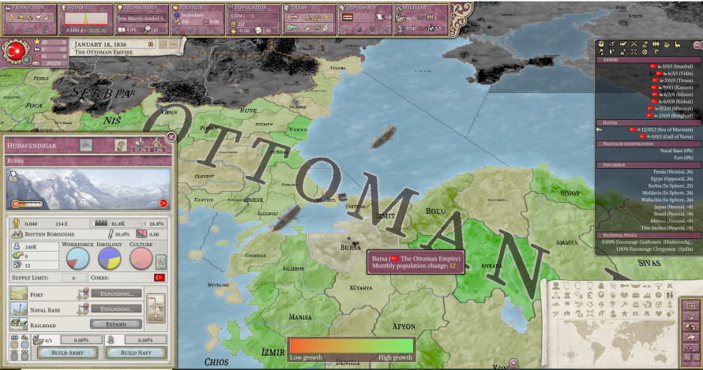

## Modding

Oh boy, what we got for modding? A handful new effects thats for sure, [extensions.md](../extensions.md) and [scripting.md](../scripting.md) greatly describe their usage in more detail, but for the purpouses of this devlog, we will just go over them in le epic easy digestible way for most users.

- **Change terrains!**: Have you ever felt like the Sahara desert should be repainted into a fucking grassland? Well now you can dynamically change terrains in the game, with the `change_terrain = terrain` effect!
- **Province flags**: Ever felt that provinces felt a bit empty? Want the fucking bigben to display on map? Or even - have province flags finally work so you don't have to make 64,000 lines of code for dynamic loc? Well fear no more, `has_province_flag`, `set_province_flag` and `clr_province_flag` are at your disposal
- **Crisis**: Want to mod crisis? Not the game, the crisis system of course! You can remove crisis with `remove_crisis`, or even, trigger one with `trigger_crisis`, set the crisis type, colony, liberation tag, giving you full total control on dynamically created crisis!
- **Change POP size additively!**: Want to add 200 pops without using the multiplicative effect of `reduce_pop`? Well that's what `change_pop_size` is for!
- **Create new POPs on the fly!**: Want to create a `protestant russian craftsmen` in the middle of nowhere? Well you no longer have to do weird assimilation tricks and pop management, now you can simply - create them!
- **Dynamic triggered flag types**: You need to mod the change of the USA flag for each new state added... tough. But wait, why not just mod it with triggers and dynamic flag types? Now you can! (You don't even have to make flags for the other nations, only for those that use the dynamic flag types!)
- **Custom event windows**: No further explanation needed, custom event windows!
- **Using defines as constants on effects**: Oh you want to check `badboy = 25` but you are forced to hardcode it to the limit and update it each time `defines.lua` is changed? No more! Just use `badboy = defines:BADBOY_LIMIT`
- **Scriptable game rules**: An experimental feature at the moment, for now it is used to script the tooltips of buttons and sliders (for example the conditions to increase the relation of a given nation). But hey it could be expanded further, if needed.
- **Moddable and dynamic political parties**: Yay! More in-depth politics modding capabilities!
- **Scriptable UI frames**:
